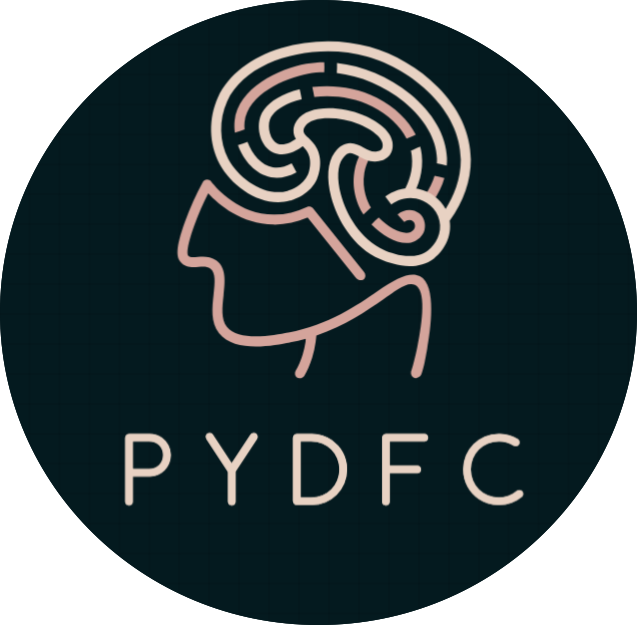

.. image:: https://zenodo.org/badge/DOI/10.5281/zenodo.10161176.svg
    :target: https://zenodo.org/doi/10.5281/zenodo.10161176

.. image:: https://img.shields.io/pypi/v/pydfc.svg
    :target: https://pypi.org/project/pydfc/
    :alt: PyPI Package

pydfc
=====

An implementation of several well-known dynamic Functional Connectivity (dFC) assessment methods.

Installation
------------

Simply install ``pydfc`` using the following steps::

    conda create --name pydfc_env python=3.11
    conda activate pydfc_env
    pip install pydfc

Examples
--------

The following example scripts illustrate how to use the toolbox:

- ``examples/dFC_methods_demo.py``
  Demonstrates how to load data and apply each of the implemented dFC methods individually.

- ``examples/multi_analysis_demo.py``
  Demonstrates how to apply multiple dFC methods on a dataset and compare their results.

For more details about the implemented methods and the comparison analysis, see our paper:

`On the variability of dynamic functional connectivity assessment methods <https://doi.org/10.1093/gigascience/giae009>`_

    Mohammad Torabi, Georgios D Mitsis, Jean-Baptiste Poline,
    *GigaScience*, Volume 13, 2024, giae009.

AI-Assisted Tutorial Experience (Optional)
------------------------------------------

In addition to the example scripts and documentation, **pydfc** provides optional
AI-assisted learning workflows that can help you explore the toolbox, understand
dynamic functional connectivity methods, and generate minimal working examples.

These options are entirely optional and do not affect the core functionality of the toolbox.

Using GitHub Copilot Prompts
~~~~~~~~~~~~~~~~~~~~~~~~~~~~

If you use **GitHub Copilot** in VS Code or Visual Studio, you can access guided
prompts that walk you through installing ``pydfc``, loading demo data, and running
key dFC methods.

The prompt set now includes a **paper-grounded deep mode** for method questions,
so users can ask about assumptions, implementation details, expected behavior,
and pros/cons with answers grounded in:

- ``docs/DFC_METHODS_CONTEXT.md``
- ``docs/PAPER_KNOWLEDGE_BASE.md``

**How to use:**

1. Open the repository in VS Code.
2. Open *Copilot Chat*.
3. Type ``/`` and run one of the available prompts::

       /00_prompts_index
       /01_install
       /02_choose_method
       /03_state_free_quickstart
       /04_state_based_quickstart
       /05_paper_method_qa
       /06_troubleshoot

4. Start with ``/00_prompts_index`` if you want a fast routing guide to choose
   the best prompt for your goal.

**What is new in this prompt experience:**

- ``/02_choose_method`` now appears right after install, so users can pick a
  method path early.
- ``/05_paper_method_qa`` is dedicated to paper-based method Q&A.
- ``/06_troubleshoot`` is now the final step in the sequence.
- Method answers are configured for deeper, assumption-first explanations and
  include citation guidance for Torabi et al., 2024 when relevant.

These prompts provide a structured, step-by-step tutorial experience and generate
copy-paste code tailored to common workflows.

We encourage users with Copilot access to try this interactive experience to
quickly become familiar with the toolbox.

Using Codex, Claude, or Other AI Coding Assistants
~~~~~~~~~~~~~~~~~~~~~~~~~~~~~~~~~~~~~~~~~~~~~~~~~~

If you use **Codex**, **Claude**, or another AI coding assistant, the repository
includes guidance files designed for AI-assisted workflows:

- ``docs/SKILL.md`` — comprehensive usage guidance and tutorial flow
- ``agents.md`` — concise agent instructions (if present)
- ``docs/DFC_METHODS_CONTEXT.md`` — assumptions, interpretation, and method
  comparison principles
- ``docs/PAPER_KNOWLEDGE_BASE.md`` — paper-grounded implementation notes,
  expected behavior, and pros/cons

You can point your AI assistant to these files or ask it to follow them when
guiding you through ``pydfc``.

**Example prompt:**

::

    Use the instructions in docs/SKILL.md to guide me through a minimal PydFC workflow.

Using Any LLM Chat (Copy-Paste Method)
~~~~~~~~~~~~~~~~~~~~~~~~~~~~~~~~~~~~~~

If you do not use Copilot, Codex, or Claude, you can still benefit from AI guidance.

**Steps:**

1. Open ``docs/SKILL.md``.
2. Copy its contents.
3. Paste it into your preferred LLM chat (e.g., ChatGPT, Claude, Gemini).
4. Ask questions such as:

   - "Guide me through the state-free quickstart."
   - "Which dFC method should I use for my dataset?"
   - "Generate a minimal Sliding Window example."

This provides a portable, copy-paste tutorial experience.

Notes on Privacy and Offline Use
~~~~~~~~~~~~~~~~~~~~~~~~~~~~~~~~

- The AI-assisted workflows described above operate within your chosen AI environment.
- No data is sent by **pydfc** itself.
- Users working with sensitive data should follow their institutional policies
  when using external AI services.

Recommended First Step
~~~~~~~~~~~~~~~~~~~~~~

If you are new to **pydfc**, we recommend starting with:

1. ``examples/dFC_methods_demo.py``
2. The Copilot prompt ``/00_prompts_index`` to pick your path quickly
3. The Copilot prompt ``/02_choose_method`` followed by
   ``/03_state_free_quickstart`` (if available)
4. Or the copy-paste method using ``docs/SKILL.md``

This optional AI-assisted workflow is designed to complement — not replace —
the documentation and example scripts.
